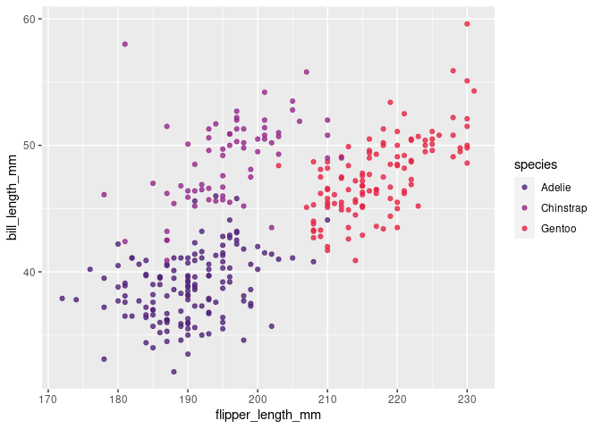
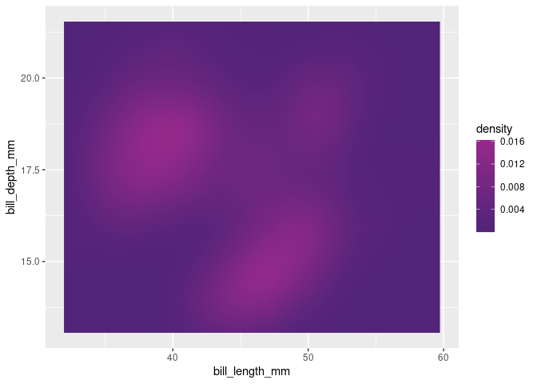

<!-- README.md is generated from README.Rmd. Please edit that file -->

# gguni

<!-- badges: start -->

[](https://lifecycle.r-lib.org/articles/stages.html#experimental)

<!-- badges: end -->

The goal of **gguni** is to provide `ggplot2` palettes for universities’
branding colours (e.g., to fit with the PowerPoint default templates).

## Installation

You can install the development version of gguni from GitHub using the
`remotes` package:

``` r
remotes::install_github("giuliocentorame/gguni")
```

## Functions and available palettes

All the functions follow the name scheme
`scale_[aesthetics]_[function family]_[type]`, where `aesthetic` is
either `fill` or `colour`, `function family` is the function family name
(see below) and `type` is either `c` for continuous palettes or `d` for
discrete palettes.

| University               | Function family name |
|--------------------------|----------------------|
| University of Queensland | `uq`                 |

## Examples

Using the `uq` family of functions, **gguni** provides palettes for both
continuous and discrete scales:

``` r
library(palmerpenguins)
library(ggplot2)
library(gguni)

ggplot(na.omit(penguins),
       aes(x = flipper_length_mm,
           y = bill_length_mm,
           colour = species)) +
  geom_point() +
  scale_colour_uq_d(palette = "discrete", alpha = 0.8)
```



``` r

ggplot(penguins,
       aes(x = bill_length_mm, y = species, fill = species)) +
  stat_summary(fun = "mean", geom = "bar", colour = "black") +
  scale_fill_uq_d(palette = "discrete")
#> Warning: Removed 2 rows containing non-finite values (`stat_summary()`).
```


``` r
ggplot(na.omit(penguins),
       aes(x = bill_length_mm, y = bill_depth_mm)) +
  stat_density_2d(
    geom = "raster",
    aes(fill = after_stat(density)),
    contour = FALSE
    ) +
  scale_fill_uq_c(palette = "continuous")
```


